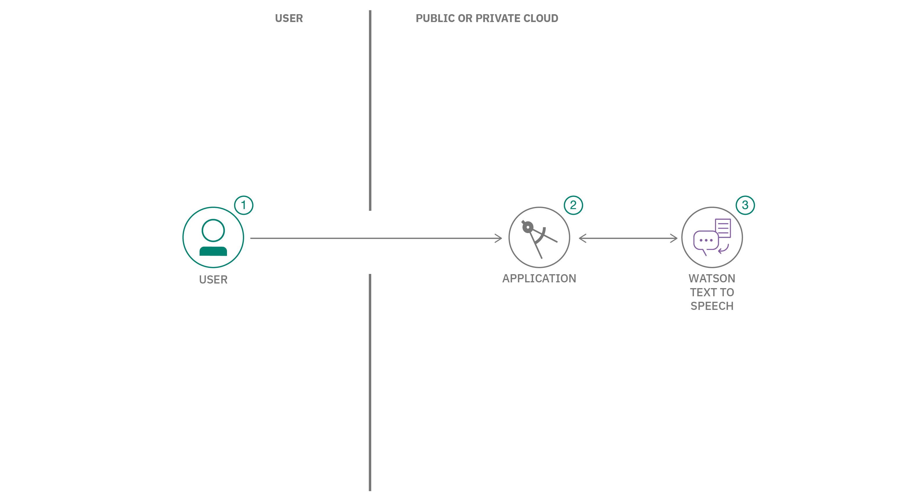

# Text to Speech Code Pattern

Sample React app for playing around with the Watson Text to Speech service

✨ **Demo:** https://text-to-speech-code-pattern.ng.bluemix.net/ ✨

## Flow

1. User supplies some text as input to the application (running locally, in the IBM Cloud or in IBM Cloud Pak for Data).
1. The application sends the text to the Watson Text to Speech service.
1. As the data is processed, the Text to Speech service returns audio information to the HTML5 audio element for playback.

## Steps

1. [Provision Watson Text to Speech](#1-Provision-Watson-Text-to-Speech)
2. [Deploy the server](#2-Deploy-the-server)
3. [Use the web app](#3-Use-the-web-app)

## 1. Provision Watson Text to Speech

> Note: You can skip this step if you will be using the `Deploy to Cloud Foundry on IBM Cloud` button below. That option automatically creates the service and binds it (providing its credentials) to the application.

The instructions will depend on whether you are provisioning services using IBM Cloud Pak for Data or on IBM Cloud.

**Click to expand one:**

<b>IBM Cloud Pak for Data</b>

<h4>Install and provision</h4>

The service is not available by default. An administrator must install it on the IBM Cloud Pak for Data platform, and you must be given access to the service. To determine whether the service is installed, click the <b>Services</b> icon () and check whether the service is enabled.

<h4>Gather credentials</h4>

<ol>
    <li>For production use, create a user to use for authentication. From the main navigation menu (☰), select <b>Administer > Manage users</b> and then <b>+ New user</b>.</li>
    <li>From the main navigation menu (☰), select <b>My instances</b>.</li>
    <li>On the <b>Provisioned instances</b> tab, find your service instance, and then hover over the last column to find and click the ellipses icon. Choose <b>View details</b>.</li>
    <li>Copy the <b>URL</b> to use as the <b>TEXT_TO_SPEECH_URL</b> when you configure credentials.</li>
    <li><i>Optionally, copy the <b>Bearer token</b> to use in development testing only. It is not recommended to use the bearer token except during testing and development because that token does not expire.</i></li>
    <li>Use the <b>Menu</b> and select <b>Users</b> and <b>+ Add user</b> to grant your user access to this service instance. This is the <b>TEXT_TO_SPEECH_USERNAME</b> (and <b>TEXT_TO_SPEECH_PASSWORD</b>) you will use when you configure credentials to allow the Node.js server to authenticate.</li>
</ol>

<b>IBM Cloud</b>

<h4>Create the service instance</h4>

* If you do not have an IBM Cloud account, register for a free trial account [here](https://cloud.ibm.com/registration).
* Click [here](https://cloud.ibm.com/catalog/services/text-to-speech) to create a **Text to Speech** instance.
  * `Select a region`.
  * `Select a pricing plan` (**Lite** is *free*).
  * Set your `Service name` or use the generated one.
  * Click `Create`.
* Gather credentials
  * Copy the <b>API Key</b> and <b>URL</b> to use when you configure and [deploy the server](#2-Deploy-the-server).

> If you need to find the service later, use the main navigation menu (☰) and select **Resource list** to find the service under **Services**.
Click on the service name to get back to the **Manage** view (where you can collect the **API Key** and **URL**).

## 2. Deploy the server

Click on one of the options below for instructions on deploying the Node.js server.

|   |   |   |   |
| - | - | - | - |
|  |  |  |

## 3. Use the web app

* Select an input `Voice model`.

* Use the demo `Text to synthesize` or enter your own text into that text box.

* Press the `Synthesize` button to create audio from that text and hear it in the selected voice.

* The audio plays automatically. You can also use the `Synthesized audio` controls to pause, play, etc.

## Developing and testing

See [DEVELOPING.md](DEVELOPING.md) and [TESTING.md](TESTING.md) for more details about developing and testing this app.

## License

This code pattern is licensed under the Apache License, Version 2. Separate third-party code objects invoked within this code pattern are licensed by their respective providers pursuant to their own separate licenses. Contributions are subject to the [Developer Certificate of Origin, Version 1.1](https://developercertificate.org/) and the [Apache License, Version 2](https://www.apache.org/licenses/LICENSE-2.0.txt).

[Apache License FAQ](https://www.apache.org/foundation/license-faq.html#WhatDoesItMEAN)
