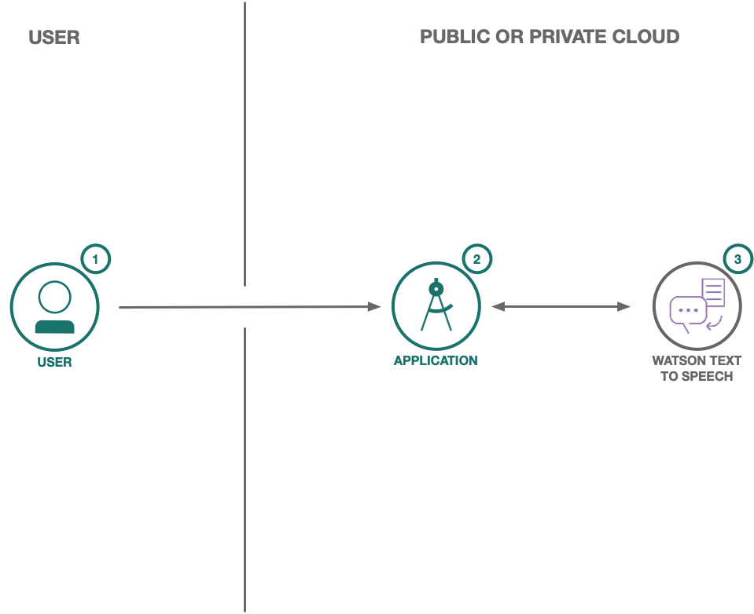

<h1 align="center" style="border-bottom: none;">Text to Speech Code Pattern 📜</h1>
<h3 align="center">Sample React app for playing around with the Watson Text to Speech service.</h3>
<p align="center">
  <a href="http://travis-ci.org/watson-developer-cloud/text-to-speech-code-pattern">
    
  </a>
  <a href="#badge">
    
  </a>
</p>
</p>

✨ **Demo:** https://text-to-speech-code-pattern.ng.bluemix.net/ ✨

## Flow

<p align="center">
  
</p>

1. User supplies some text as input to the application (running locally, in the IBM Cloud or in IBM Cloud Pak for Data).
1. The application sends the text to the Watson Text to Speech service.
1. As the data is processed, the Text to Speech service returns audio information to the HTML5 audio element for playback.

## Prerequisites

1. Sign up for an [IBM Cloud account](https://cloud.ibm.com/registration/).
1. Download the [IBM Cloud CLI](https://cloud.ibm.com/docs/cli/index.html#overview).
1. Create an instance of the Text to Speech service and get your credentials:
   - Go to the [Text to Speech](https://cloud.ibm.com/catalog/services/text-to-speech) page in the IBM Cloud Catalog.
   - Log in to your IBM Cloud account.
   - Click **Create**.
   - Click **Show** to view the service credentials.
   - Copy the `apikey` value.
   - Copy the `url` value.

### Cloud Pak for Data

To use this code pattern with a Text to Speech instance provisioned on Cloud Pak for Data, you can use your CPD `username` and `password` credentials or an `access_token` to authenticate your requests. You also need the service `url` as described [here](https://cloud.ibm.com/apidocs/text-to-speech/text-to-speech-data#authentication).

Another important thing to note is that this code pattern assumes that you're using a **valid SSL certificate** for your CPD cluster. If not, you'll receive transcription errors. If you'd still like to use the app with an invalid certificate, you'll need to look up your browser-specific way to ignore these certificate errors. Do note that this is very insecure though!

## Configuring the application

Depending on where your service instance is you may have different ways to download the credentials file.

> Need more information? See the [authentication wiki](https://github.com/IBM/node-sdk-core/blob/master/AUTHENTICATION.md).

### Automatically

Copy the credential file to the application folder.

**Cloud Pak for Data**

<p align="center">
  
</p>

**Public Cloud**

<p align="center">
  
</p>

### Manually

1. In the application folder, copy the `.env.example` file and create a file called `.env`:

   ```
   cp .env.example .env
   ```

2. Open the `.env` file and add the service credentials depending on your environment.

   Example `.env` file that configures the `apikey` and `url` for a Speech to Text service instance hosted in the US South region:

   ```
   TEXT_TO_SPEECH_APIKEY=12345abcde
   TEXT_TO_SPEECH_URL=https://stream.watsonplatform.net/text-to-speech/api
   ```

   - **CPD using username and password:** If your service instance is running in Cloud Pak for Data and you want to use `username` and `password` credentials, add the following variables to the `.env` file.

     ```
     TEXT_TO_SPEECH_USERNAME=admin
     TEXT_TO_SPEECH_PASSWORD=password
     TEXT_TO_SPEECH_URL=https://{cpd-url}:{cpd-port}/text-to-speech/api
     ```

   - **CPD using access token:** If your service instance is running in Cloud Pak for Data and you want to use the `access_token` from the service instance detail page, add the following:

     ```
     TEXT_TO_SPEECH_BEARER_TOKEN=eyJhbGciOiJSUzI1NiIsInR5cCI6IkpXVCJ9.ey...
     TEXT_TO_SPEECH_URL=https://{cpd-url}:{cpd-port}/text-to-speech/api
     ```

## Running locally

1. Install the dependencies

   ```
   npm install
   ```

1. Build the application

   ```
   npm run build
   ```

1. Run the application

   ```
   npm run dev
   ```

1. View the application in a browser at `localhost:3000`

## Deploying to IBM Cloud as a Cloud Foundry Application

Click on the button below to deploy this demo to the IBM Cloud.

[](https://cloud.ibm.com/devops/setup/deploy?repository=https://github.com/watson-developer-cloud/text-to-speech-code-pattern)

1. Build the application

   ```
   npm run build
   ```

1. Login to IBM Cloud with the [IBM Cloud CLI](https://cloud.ibm.com/docs/cli/index.html#overview)

   ```
   ibmcloud login
   ```

1. Target a Cloud Foundry organization and space.

   ```
   ibmcloud target --cf
   ```

1. Edit the `manifest.yml` file. Change the **name** field to something unique. For example: `- name: my-app-name`.
1. Deploy the application

   ```
   ibmcloud app push
   ```

1. View the application online at the app URL, for example: https://my-app-name.mybluemix.net

## Tests

#### Unit tests

Run unit tests with:

```
npm run test:components
```

See the output for more info.

#### Integration tests

First you have to make sure your code is built:

```
npm run build
```

Then run integration tests with:

```
npm run test:integration
```

## Directory structure

```none
.
├── app.js                      // Express routes
├── config                      // Express configuration
│   ├── error-handler.js
│   ├── express.js
│   └── security.js
├── package.json
├── public                      // Static resources
├── server.js                   // Entry point
├── test                        // Tests
└── src                         // React client
    └── index.js                // App entry point
```

## License

This sample code is licensed under the [MIT License](https://opensource.org/licenses/MIT).

## Open Source @ IBM

Find more open source projects on the [IBM Github Page](http://ibm.github.io/)

